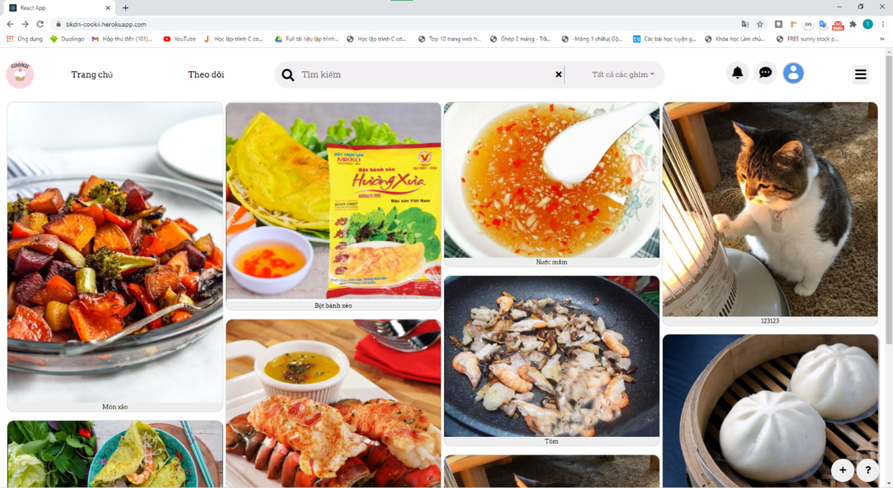

# Social Cookii - Food recipes social network
## Introduction
This website was coded with MERN stack.
Social Cookii is a food social network which share food recipes. This is a platform helping to introduce, popular your own dishes from simple to complex, from rustic to unique. So everyone can help each other to make a lot of delicious and attractive dishes through comments.

## Contributions
1. Nguyen Van Dai - 17T2 - DUT
2. Phan Van Vu - 17T2 - DUT
3. Chau Viet Trung - 17T2 - DUT
4. Tran Thi Thu Cong - 17T2 - DUT
5. Pham Thi Thuy Duong - 17T2 - DUT

## Technologies

- **M** = MongoDB (We'll use Mongoose to make it easier for Node.js to work with MongoDB, and we'll use MongoDB Atlas = MongoDB database, but cloud).
- **E** = Express (makes it easier to work with Node.js).
- **R** = React (for the frontend. We'll use `bootstrap` for styling, `react-router-dom` for React routes and `fetch` to connect to the backend).
- **N** = Node.js (for the server. We'll use `dotenv` to load environment variables from an .env file into `process.env`, and `nodemon` to make the app auto-restart when you edit/save files).


## Installation
To just get it running after you `git clone`, set up [MongoDB Atlas] with data in `database` directory, and then follow these CLI steps, Install it locally using npm:

```bash
cd SocialCookii
npm run init-package
npm run dev


```
This is our homepage


Thanks for reading!
